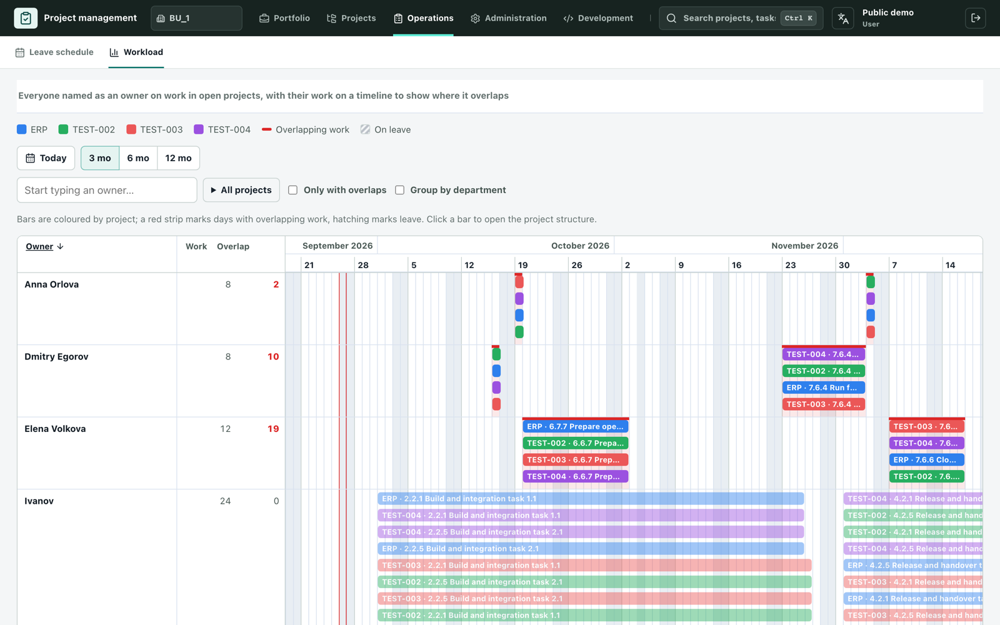
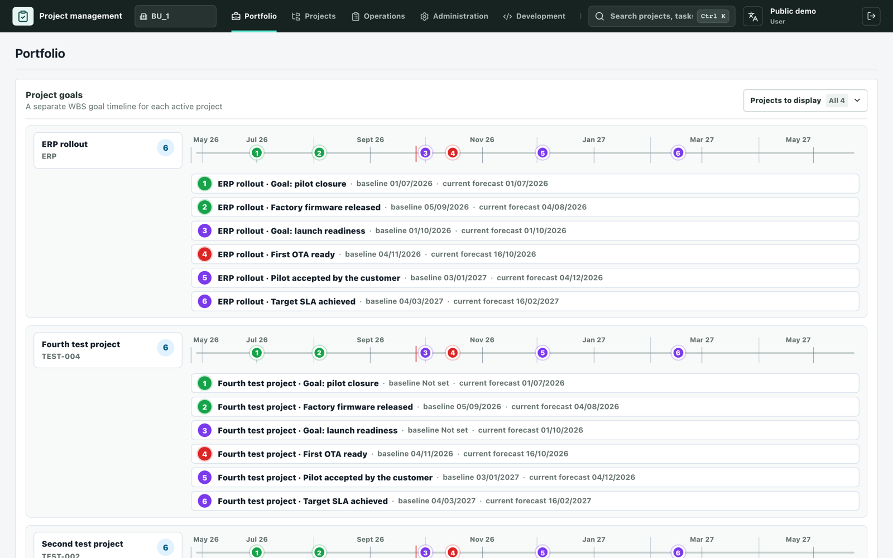
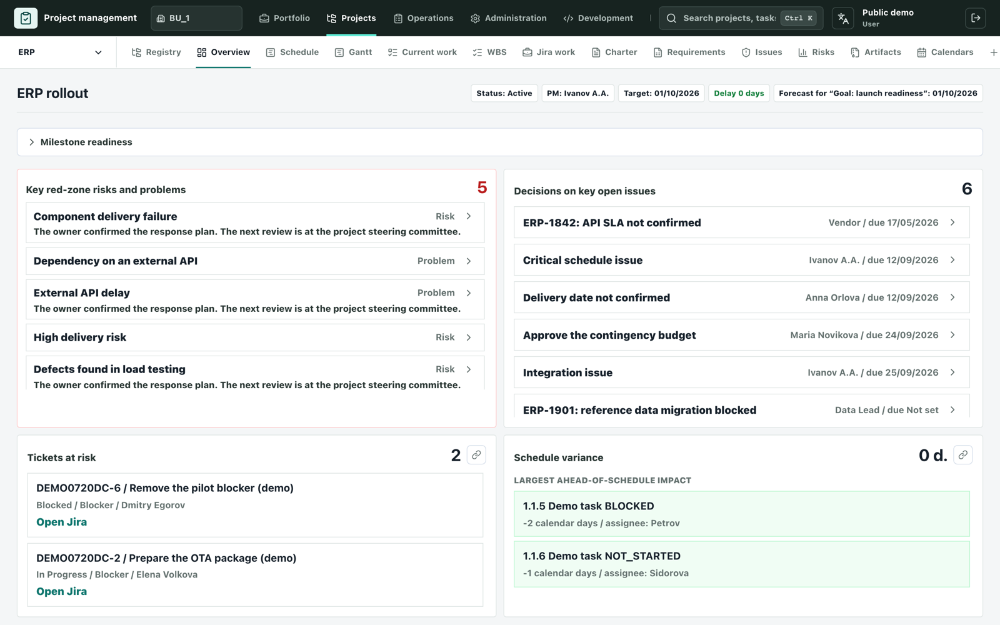
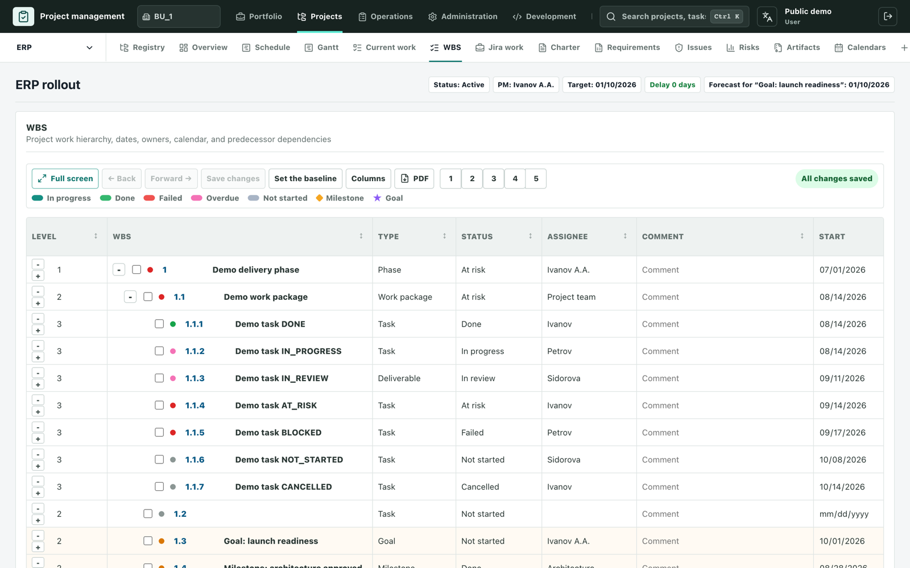
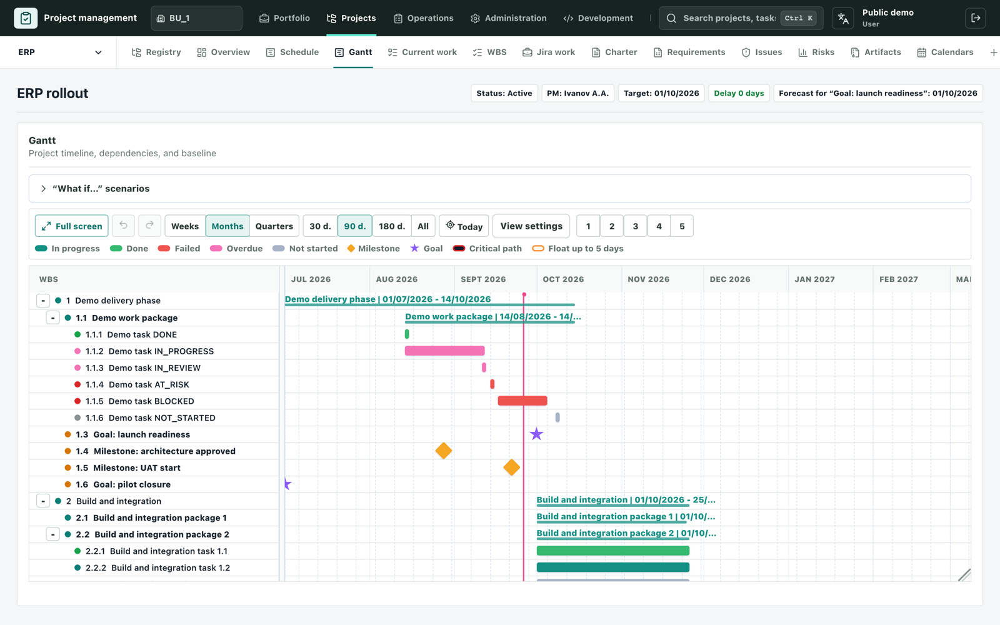
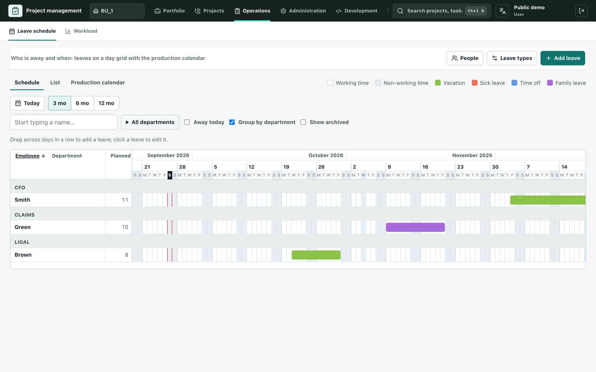

# Gantry

**A lightweight portfolio and project management system — the essentials of tools like Asana, without the weight.**
Portfolio and projects, WBS, Gantt, open issues and risks in one self-hosted tool, with read-only Jira sync.

**[▶ Open the live demo](https://project-management-system-lorj.onrender.com/)** — no sign-up needed · [Self-hosting](docs/docker-deployment.md) · [License](#license)

## Why Gantry?

Big work-management suites do a lot, and ask a lot in return: licences per seat, weeks of setup, and a new way of working for everyone. Gantry keeps what project and portfolio managers rely on every day and leaves the rest out:

- **Portfolio and projects.** Every active project with its goals, key risks and blocking problems on one page, and a full workspace for each project.
- **WBS you can type into.** The work breakdown is edited like a spreadsheet: type in cells, paste rows, move with the keyboard, undo and redo.
- **Gantt that plans.** Dependencies, lead and lag, critical path, baselines and "what if" scenarios.
- **Issues and risks next to the plan.** Open issues with decisions and owners, a risk register with a matrix, all linked to the work they affect.
- **Jira stays your tracker.** Jira is synchronised read-only: issues flow into the plan and reports, and nothing is ever written back.
- **Yours to run.** Self-hosted with Docker and PostgreSQL, optional Keycloak single sign-on, English and Russian interface.

## Features

**Planning**
- Work breakdown structure (WBS) with phases, work packages, tasks, milestones and goals
- Gantt chart with finish-to-start and start-to-start dependencies, lead and lag, critical path and float
- Baselines and forecast dates, configurable production calendars with holidays and working weekends for working-day maths
- "What if" scenarios on the Gantt, PDF export of the plan

**Control**
- Project overview: red-zone risks, decisions on key open issues, tickets at risk, schedule variance
- Risk, problem and assumption register with a risk matrix
- Open issues with owners, due dates, decisions and linked Jira tickets
- Goals and milestones timeline with baseline versus forecast

**Portfolio and people**
- Portfolio: goal timelines for every active project, blocking problems and key risks
- Workload: every owner's work across all projects on one timeline, with overlaps highlighted
- Leave schedule: who is away and when, with leave types and a working-day count

**Administration**
- Business units, roles and permissions, per-project access
- Dictionaries, WBS templates, audit log, API tokens and webhooks
- Read-only Jira and GitLab integrations

## Screenshots

| | |
|---|---|
|  **Portfolio** — goal timelines across projects |  **Project overview** — risks, decisions and schedule variance |
|  **WBS** — the plan, edited like a spreadsheet |  **Gantt** — dependencies, baseline and critical path |
|  **Leave schedule** — who is away and when |  **Workload** — where people's work overlaps |

## Try it

- **Live demo:** [project-management-system-lorj.onrender.com](https://project-management-system-lorj.onrender.com/). You enter as a demo user and can edit the sample projects; the data is shared with other visitors.
- **Self-host:** the application ships as one Docker image (API and web UI) and needs PostgreSQL. See [docs/docker-deployment.md](docs/docker-deployment.md) (in Russian); Kubernetes manifests are in [`deploy/k8s`](deploy/k8s).
- **Develop:** Node.js 22–25, npm 10+, PostgreSQL. See [docs/DEVELOPMENT.md](docs/DEVELOPMENT.md).

Built with React, TypeScript, Express, Prisma and PostgreSQL.

## Feedback

Questions, ideas and bug reports are welcome in [GitHub Issues](https://github.com/kelebrik/project-management-system/issues).

## License

Source-available under the [Project Management System Non-Commercial License](LICENSE):

- free for personal, educational, research and internal company use;
- you may not sell it, rent it out, offer it as a paid hosted service or otherwise make money from it;
- copies and derivative works must keep the license and credit **kelebrik &lt;kelebrik@gmail.com&gt;**.

This is not an OSI-approved open-source license. Configure credentials and tokens through environment variables and never commit them.
