# Техническое задание

**Проект:** корпоративная web-система управления проектами с отдельным модулем подготовки executive overview для топ-менеджмента.  
**Версия ТЗ:** 0.1  
**Дата:** 13.05.2026  
**Целевая платформа:** Ubuntu Server, web UI для проектных менеджеров и отдельный web UI back office для администраторов.

---

## 1. Назначение системы

Система должна стать единым корпоративным контуром для управления проектами, программами и портфелями: от проектной инициативы и планирования до контроля исполнения, бюджета, ресурсов, рисков, изменений, отчетности и подготовки управленческих обзоров для руководства.

Ключевое отличие системы: отдельный модуль **Executive Overview**, который не просто показывает dashboard, а формирует управляемый management pack по проекту или портфелю: с авто-сводкой, ссылками на источники данных, редактурой PM/PMO, согласованием, версионированием, публикацией, экспортом в PDF/PPTX и созданием задач по решениям руководства.

## 2. Анализ лучших практик и конкурентных систем

Анализ выполнен по официальным материалам и документации поставщиков. Вывод: зрелые системы уже закрывают планирование, портфели, dashboards, ресурсы, риски и AI-статусы. Но отдельный end-to-end модуль управленческого overview с проверкой источников, редакционным циклом, публикацией и реестром решений встречается не как самостоятельный законченный контур, а как набор dashboards, reports, AI status updates или BI-интеграций.

### 2.1 Microsoft Project / Planner Premium / Project Online / Project Server

Практики для заимствования:

- Grid/Board/Timeline/Gantt-представления, зависимости, custom fields, team workload, goals, critical path и milestones в premium-планах Planner/Project.
- Портфельная и ресурсная отчетность через Power BI templates.
- Использование Dataverse/Power Platform-подхода как примера разделения бизнес-данных, отчетности и low-code extension.
- Project Server/Project Online как ориентир для enterprise PPM: портфели, ресурсы, timesheets, Project Web App, интеграции и reporting.

Источники:

- Microsoft: Project for the web / Planner transition and premium capabilities: https://support.microsoft.com/en-us/office/frequently-asked-questions-about-microsoft-planner-d1a2d4e6-a4d7-408c-a48a-31caaa267de5
- Microsoft: premium Planner capabilities: https://support.microsoft.com/en-us/office/advanced-capabilities-with-premium-plans-in-planner-6cdba2aa-da06-4e08-be4c-baaa4fda17ba
- Microsoft: Power BI template reports for Project for the web: https://support.microsoft.com/en-gb/office/roadmap-reports-in-project-for-the-web-power-bi-template-e50d4d62-6530-45e1-940d-ff8341597ca8
- Microsoft Learn: Project Online service description: https://learn.microsoft.com/en-gb/office365/servicedescriptions/project-online-service-description/microsoft-project-online-service-description
- Microsoft Learn: Project Server architecture: https://learn.microsoft.com/en-us/project/project-server-subscription-edition-architecture

### 2.2 OpenProject

Практики для заимствования:

- Project home как единый центр проекта: Overview tab, Dashboard tab, widgets, project lifecycle, attributes.
- Настраиваемые widgets: description, status, members, news, budgets, work package graphs.
- Open-source подход, web-based Gantt, multi-project timelines, relations, hierarchies, work packages, calendar, export.
- Time/cost tracking, budgets, cost reports.
- Portfolio module для стратегического обзора, иерархий, фильтров и leadership insights.
- Важное ограничение: в документации OpenProject отдельно отмечается, что полноценный resource management не является базовой зрелой функцией и развивается в roadmap. Это показывает, что ресурсный модуль лучше проектировать как отдельный полноценный контур, а не как расширение задач.

Источники:

- OpenProject project home / overview: https://www.openproject.org/docs/user-guide/project-overview/
- OpenProject planning and scheduling: https://www.openproject.org/collaboration-software-features/project-planning-scheduling/
- OpenProject time and costs: https://www.openproject.org/docs/user-guide/time-and-costs/index.html
- OpenProject portfolio management use case: https://www.openproject.org/docs/use-cases/portfolio-management/
- OpenProject roadmap: https://www.openproject.org/roadmap/

### 2.3 GanttPRO

Практики для заимствования:

- Простая, сфокусированная модель project/task/team/time management без перегруженного интерфейса.
- Gantt, Grid, Board, Calendar views.
- Baseline, critical path, project calendars, history of changes.
- Dependencies, lag/lead, auto scheduling.
- Workload, personal calendars, virtual resources.
- Budget и actual cost, time log reports, budget analysis.
- Portfolio view как high-level обзор нескольких проектов на едином Gantt.
- Sharing/export в PNG/PDF/XML/Excel.

Источники:

- GanttPRO core features: https://help.ganttpro.com/hc/en-us/articles/4403968959505-Core-features
- GanttPRO features: https://ganttpro.com/ganttpro-features/
- GanttPRO portfolio: https://help.ganttpro.com/hc/en-us/articles/18252634987282-About-Portfolio
- GanttPRO portfolio management: https://help.ganttpro.com/hc/en-us/articles/18253453898514-Project-portfolio-management

### 2.4 Oracle Primavera Cloud / P6

Практики для заимствования:

- Enterprise scheduling, resource, risk и portfolio management как отдельные дисциплины.
- Качественный и количественный risk analysis, включая влияние рисков на сроки и бюджет.
- Portfolio thresholds и alerts.
- Dashboards для workspace, portfolio, program и project levels.
- Schedule health metrics и KPI drill-down.
- Portfolio budget/resource planning и snapshots.

Источники:

- Oracle Primavera Cloud overview: https://www.oracle.com/construction-engineering/primavera-cloud-project-management/
- Oracle Primavera Cloud risk overview: https://docs.oracle.com/cd/E80480_01/help/en/user/88293.htm
- Oracle Primavera Cloud portfolios: https://docs.oracle.com/cd/E80480_01/English/user_guides/portfolio_management_user_guide/221561.htm
- Oracle Primavera Cloud dashboards: https://docs.oracle.com/cd/E80480_01/English/admin/p6_eppm_migration_guide/246426.htm
- Oracle schedule health page: https://docs.oracle.com/cd/F37378_01/English/user/analytics_ref/85320.htm

### 2.5 Jira / Jira Align

Практики для заимствования:

- Issue-centric execution, dashboards as gadget collections, agile/forecast/management reports.
- Timeline с dependencies для визуализации сроков и блокеров.
- Jira Align как пример enterprise слоя: связь стратегии, portfolio, program, dependencies, risks, roadmaps и team-level delivery.
- Полезный паттерн: operational teams продолжают работать в привычных инструментах, а portfolio layer агрегирует статусы, риски, зависимости и результаты.

Источники:

- Jira reports and dashboards: https://www.atlassian.com/software/jira/guides/reports-dashboards/overview
- Jira timeline guide: https://www.atlassian.com/software/jira/guides/basic-roadmaps
- Jira Align: https://www.atlassian.com/software/jira/align

### 2.6 Smartsheet

Практики для заимствования:

- PPM через standardized templates, intake, Control Center, automated provisioning, governance и portfolio dashboards.
- Real-time visibility по status, risks, financials, resources.
- Resource Management heat maps, capacity, availability и workload.
- Secure stakeholder sharing и controlled access.

Источники:

- Smartsheet PPM software: https://www.smartsheet.com/content/project-portfolio-management-software
- Smartsheet Control Center: https://www.smartsheet.com/product/control-center
- Smartsheet project portfolio dashboards: https://www.smartsheet.com/content/project-portfolio-dashboards
- Smartsheet resource management: https://help.smartsheet.com/learning-track/getting-started-resource-management

### 2.7 Asana

Практики для заимствования:

- Project Overview tab: health, roles, due dates, messages, milestones, goals, recent status updates.
- Portfolio Progress: status across projects, status updates, dashboards, charts, custom field rollups.
- Smart Status: AI-драфт status updates для projects, portfolios и goals с user guidance и последующим редактированием.

Это близко к требуемому executive overview, но не покрывает весь контур management pack с evidence control, согласованием, публикацией, версионированием PDF/PPTX и реестром решений как отдельный модуль.

Источники:

- Asana project progress and status updates: https://help.asana.com/s/article/project-progress-and-status-updates
- Asana portfolio progress and reporting: https://help.asana.com/s/article/portfolio-progress-and-reporting
- Asana Smart Status: https://help.asana.com/s/article/smart-status
- Asana dashboards: https://help.asana.com/s/article/reporting-with-dashboards

### 2.8 ClickUp

Практики для заимствования:

- Dashboards как live command center с обновлением задач из dashboard.
- AI Cards: AI Project Update, AI Executive Summary, AI StandUp.
- Project Status Summarizer agent: генерирует dated status update с overview, wins, blockers, next steps и references.
- ClickUp Accelerator упоминает Executive Summary Generator для executive-level engagement/portfolio summaries.

Это самое близкое найденное направление по “авто-сводкам”, но оно описано как AI agent/status summary внутри ClickUp, а не как отдельный управляемый модуль для корпоративного management pack с доказательной панелью, workflow согласования и строгими правилами публикации.

Источники:

- ClickUp dashboards: https://clickup.com/features/dashboards
- ClickUp Project Status Summarizer: https://help.clickup.com/hc/en-us/articles/37712985466007-Project-Status-Summarizer
- ClickUp Accelerator / Super Agents: https://help.clickup.com/hc/en-us/articles/37714610164375-ClickUp-Accelerator
- ClickUp AI Cards: https://help.clickup.com/hc/en-us/articles/30554022309655-AI-Cards

### 2.9 monday.com, Wrike, Planview

Практики для заимствования:

- monday.com: portfolio dashboards, automated cross-project dashboards, templates, workload/cost tracking, AI risk flagging.
- Wrike: customizable auto-updating reports, dashboards, PPM workflow, request forms, advanced analytics, shared dashboards.
- Planview: стратегическое портфельное управление, capacity/demand, investment scoring, executive dashboards, financials, risk and dependency views, AI-assisted decisions.

Источники:

- monday.com All Projects Dashboard: https://support.monday.com/hc/en-us/articles/23921675672466-Portfolio-management-All-Projects-Dashboard
- monday.com project management: https://support.monday.com/hc/en-us/articles/360014437599-Project-management-with-monday-com
- Wrike reports: https://help.wrike.com/hc/en-us/articles/209604449-Reports-in-Wrike
- Wrike PPM: https://www.wrike.com/use-cases/project-portfolio-management/
- Planview Strategic Portfolio Management: https://www.planview.com/products-solutions/solutions/strategic-portfolio-management/
- Planview PPM: https://www.planview.com/products-solutions/products/ppm-pro/project-management-dashboards-reports/

## 3. Выводы по лучшим практикам

Система должна объединить следующие практики:

1. **Single source of truth:** все проектные данные должны иметь владельца, дату обновления, источник, версию и историю изменений.
2. **Многоуровневая модель:** task → work package → project → program → portfolio → strategic goal.
3. **Несколько рабочих представлений:** List, Board, Gantt, Calendar, Timeline, Dashboard, Presentation View.
4. **Настраиваемые dashboards:** widgets, saved views, drill-down, share links, export.
5. **Метрики здоровья проекта:** RAG, schedule variance, budget variance, scope stability, resource risk, risk exposure, decision latency.
6. **Baseline и forecast:** план должен сравниваться не только с фактом, но и с прогнозом.
7. **Ресурсное планирование как отдельный модуль:** capacity, demand, allocation, overload, skills, calendars, rates.
8. **Риски и управление изменениями:** риски, допущения, проблемы, зависимости и изменения должны иметь влияние на сроки, бюджет, scope и executive overview.
9. **Governed reporting:** отчетность должна быть управляемой: формулы, шаблоны, права, версии, аудит.
10. **Executive overview как продуктовый модуль:** не dashboard и не PDF-экспорт, а полный процесс подготовки управленческого материала.

---

## 4. Роли пользователей

| Роль | Основные права |
|---|---|
| System Admin | Полная настройка системы, пользователи, роли, справочники, интеграции, аудит, backups |
| PMO Admin | Шаблоны проектов, методологии, RAG formulas, portfolio governance, workflow |
| Portfolio Manager | Управление портфелями, приоритизация, scoring, capacity/financial overview |
| Program Manager | Управление программами, межпроектные зависимости, статус программы |
| Project Manager | Создание и ведение проектов, план, задачи, бюджет, риски, статусы, overview |
| Resource Manager | Пул ресурсов, capacity, назначение, конфликты, ставки |
| Finance Controller | Бюджет, actuals, forecast, approval финансовых изменений |
| Team Member | Задачи, time logging, комментарии, документы, статусы |
| Sponsor / Executive | Просмотр executive overview, dashboards, decisions, approvals |
| Auditor / Read-only | Просмотр разрешенных данных, журналов и опубликованных версий |

## 5. Общая карта модулей

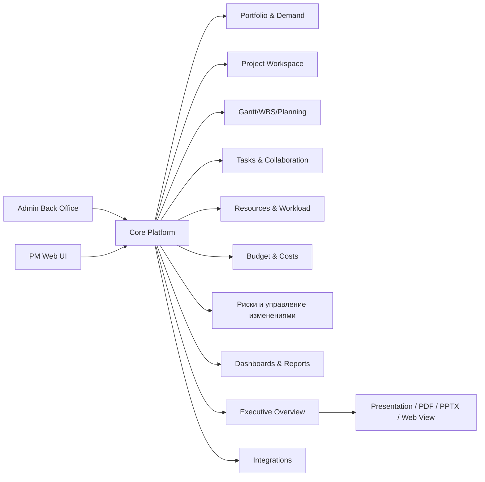

---

## 6. Функциональные требования по модулям

## 6.1 Модуль авторизации, пользователей и ролей

### Назначение

Обеспечить безопасный доступ к системе, разграничение прав и аудит пользовательских действий.

### Требования

- Поддержать локальную аутентификацию: email/login + password.
- Поддержать SSO через OIDC/SAML 2.0: Keycloak, Microsoft Entra ID, Google Workspace.
- Поддержать MFA для администраторов и опционально для всех пользователей.
- Реализовать RBAC с возможностью настройки прав:
  - на уровень приложения;
  - на уровень портфеля/программы/проекта;
  - на уровень финансовых данных;
  - на уровень executive overview;
  - на уровень админских функций.
- Поддержать проектные роли: Sponsor, PM, PMO, Team Member, Reviewer, Approver.
- Поддержать делегирование прав на период отпуска/замещения.
- Реализовать блокировку пользователя, reset password, session revoke.
- Хранить audit trail: login/logout, failed login, изменения ролей, экспорт данных, публикация overview.

### Приемочные критерии

- Администратор может создать роль и назначить ей granular permissions без изменения кода.
- Пользователь без права Finance не видит budget/actual/forecast.
- Все изменения ролей фиксируются в аудите с автором, датой и старым/новым значением.

---

## 6.2 Web UI Front для проектных менеджеров

### Назначение

Основной интерфейс для PM, PMO, участников команды, ресурсных менеджеров и руководителей проектов.

### Требования

- Единая навигация:
  - Портфели;
  - Проекты;
  - Мои задачи;
  - Ресурсы;
  - Финансы;
  - Риски и изменения;
  - Dashboards;
  - Executive Overview.
- Персональная стартовая страница:
  - мои проекты;
  - мои задачи;
  - просрочки;
  - ожидающие согласования;
  - последние изменения;
  - upcoming milestones.
- Глобальный поиск по проектам, задачам, документам, рискам, решениям и overview.
- Saved views и пользовательские фильтры.
- Deep links на любой объект системы.
- Responsive layout для desktop/tablet; мобильный интерфейс в первой версии только read/update для задач и approvals.

### Эскиз

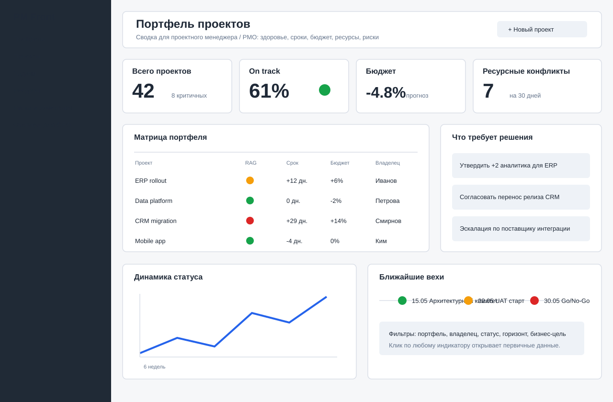

---

## 6.3 Web UI Back для администратора системы

### Назначение

Отдельный административный интерфейс для настройки системы, справочников, workflow, ролей, интеграций и мониторинга состояния.

### Требования

- Разделы:
  - пользователи и группы;
  - роли и права;
  - справочники;
  - типы проектов;
  - шаблоны WBS;
  - шаблоны задач;
  - RAG formulas;
  - workflow согласования;
  - custom fields;
  - integrations;
  - API tokens;
  - audit log;
  - system health;
  - backup/restore status.
- Поддержать настройку без деплоя:
  - статусы задач и проектов;
  - типы рисков и матрицы вероятности/влияния;
  - типы change requests;
  - шаблоны executive overview;
  - маршруты согласования;
  - обязательность полей по типам проектов.
- Поддержать import/export конфигурации в JSON/YAML.

### Приемочные критерии

- PMO Admin может добавить новый тип проекта и шаблон WBS без участия разработчика.
- System Admin может включить/отключить интеграцию и проверить ее состояние.
- Любое изменение справочника логируется.

### Эскиз

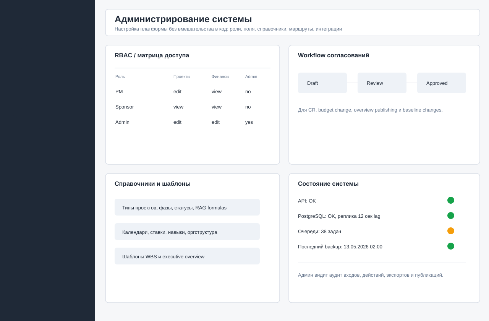

---

## 6.4 Модуль портфелей, программ и проектных инициатив

### Назначение

Управление проектным контуром до запуска проекта и на уровне портфеля: intake, scoring, приоритизация, связь со стратегическими целями.

### Функции

- Создание проектной инициативы через форму intake.
- Настраиваемые поля инициативы:
  - бизнес-заказчик;
  - проблема/возможность;
  - ожидаемый эффект;
  - CAPEX/OPEX оценка;
  - срок;
  - реестр рисков;
  - dependency;
  - compliance/регуляторная обязательность.
- Scoring model:
  - strategic fit;
  - ROI/NPV или qualitative value;
  - risk;
  - urgency;
  - resource impact;
  - customer/business impact.
- Stage-gate процесс:
  - Draft;
  - Submitted;
  - PMO Review;
  - Finance Review;
  - Portfolio Committee;
  - Approved;
  - Rejected;
  - Deferred;
  - Converted to Project.
- Portfolio dashboard:
  - RAG;
  - budget;
  - forecast;
  - benefits;
  - capacity demand;
  - top risks;
  - decisions required;
  - dependency map.
- Поддержка иерархий:
  - portfolio → program → project;
  - strategic goal → portfolio/project;
  - organization unit → portfolio/project.

### Приемочные критерии

- Инициатива может быть переведена в проект с сохранением исходных данных и audit trail.
- Portfolio Manager может сравнить инициативы по scoring и ресурсной емкости.
- Руководитель видит portfolio health без доступа к операционным деталям задач.

---

## 6.5 Модуль карточки проекта / Project Workspace

### Назначение

Единая страница проекта, где PM и заинтересованные стороны видят паспорт, состояние, цели, план, команду, документы, статусы и последние решения.

### Требования

- Паспорт проекта:
  - название;
  - код проекта;
  - портфель/программа;
  - спонсор;
  - PM;
  - заказчик;
  - методология: Waterfall, Agile, Hybrid;
  - дата старта/окончания;
  - baseline start/end;
  - статус;
  - RAG;
  - цели;
  - KPI/benefits;
  - budget;
  - priority.
- Редактирование паспорта проекта из PM UI:
  - статус проекта;
  - RAG;
  - сроки;
  - бюджет plan/forecast;
  - progress;
  - summary для управленческой отчетности.
- Управление вехами проекта:
  - title;
  - due date;
  - status: Planned, In Progress, At Risk, Done, Cancelled;
  - owner;
  - description;
  - использование ближайшей активной вехи в Executive Overview.
- Project health:
  - overall RAG;
  - schedule RAG;
  - budget RAG;
  - scope RAG;
  - resource RAG;
  - risk RAG.
- Widgets:
  - progress;
  - milestones;
  - open decisions;
  - top risks/issues;
  - blockers;
  - recent activity;
  - latest status report;
  - linked documents.
- История статусов:
  - дата;
  - автор;
  - RAG;
  - summary;
  - changes since previous status.
- Команда проекта и matrix of responsibility.

### Эскиз

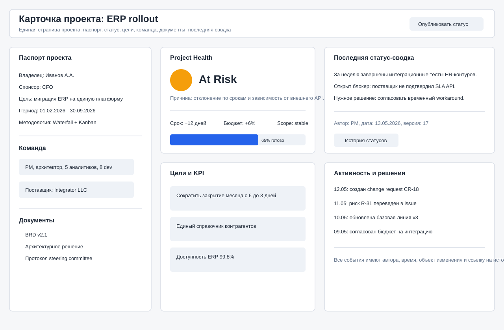

---

## 6.6 Модуль WBS, Gantt и календарного планирования

### Назначение

Планирование работ, сроков, зависимостей, базовых линий и критического пути.

### Функции

- WBS:
  - иерархия задач не менее 10 уровней;
  - summary tasks;
  - milestones;
  - deliverables;
  - packages.
- Gantt:
  - drag & drop;
  - zoom day/week/month/quarter/year;
  - dependencies FS/SS/FF/SF;
  - lag/lead;
  - critical path;
  - baseline overlay;
  - forecast dates;
  - date constraints;
  - calendar exceptions;
  - manual/auto scheduling.
- Baselines:
  - создание baseline версии;
  - сравнение baseline/current/forecast;
  - комментарий к изменению baseline;
  - workflow согласования baseline changes.
- Calendars:
  - global work calendar;
  - project calendar;
  - resource calendar;
  - holidays/non-working days;
  - time zones.
- Import/export:
  - XLSX/CSV;
  - PDF/PNG for Gantt;
  - MS Project XML/MPP support как отдельный этап после MVP.

### Приемочные критерии

- Сдвиг задачи с зависимостями пересчитывает связанные даты.
- PM видит, какие задачи находятся на критическом пути.
- Сравнение baseline/current показывает отклонение по срокам и проценту.

### Эскиз

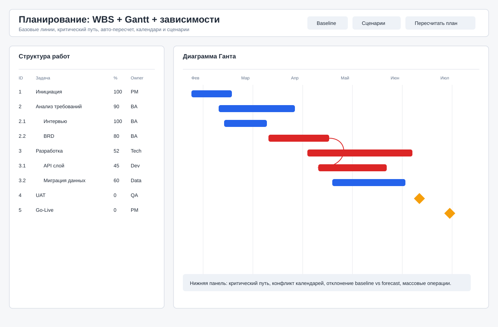

---

## 6.7 Модуль задач, Jira-связей и исполнения

### Назначение

Операционная работа команд по задачам ведется в Jira. Данная система не должна дублировать Kanban-доску Jira, а должна хранить управленческие задачи, связи с WBS/milestones/risks/CR и подтягивать Jira issue snapshot для портфельной отчетности, open issues list и executive overview.

### Принцип интеграции с Jira

- Jira остается system of record для командной Kanban/Scrum-доски.
- В системе должна быть ссылка на Jira board проекта и deep links на Jira tickets.
- Встраивание готовой Jira board в iframe не является базовым требованием: у Jira Cloud/Data Center часто действуют политики безопасности, SSO и X-Frame restrictions. Базовый UX: кнопка “Открыть доску в Jira” + синхронизированная сводка по issues.
- Синхронизация выполняется через Jira REST API и JQL.
- Для каждого проекта задаются:
  - Jira base URL;
  - board URL;
  - project key;
  - JQL для задач проекта;
  - JQL для open issues/blockers;
  - credentials/integration token;
  - schedule синхронизации.

### Функции

- Представления:
  - List;
  - Calendar;
  - Timeline;
  - My Tasks;
  - Jira Issues Snapshot;
  - Open Issues List.
- Карточка задачи:
  - title;
  - description;
  - assignee;
  - reporter;
  - status;
  - priority;
  - start/due date;
  - estimate;
  - actual;
  - percent complete;
  - tags;
  - custom fields;
  - parent/child;
  - linked risks/issues/CR;
  - jiraTicketKey;
  - jiraTicketUrl;
  - jiraStatus;
  - jiraAssignee;
  - jiraPriority;
  - jiraUpdatedAt;
  - attachments;
  - comments;
  - checklist;
  - audit log.
- Jira issue snapshot:
  - issue key;
  - summary;
  - status;
  - assignee;
  - priority;
  - issue type;
  - sprint;
  - labels/components;
  - due date;
  - updated date;
  - blocked/blocker flags;
  - source URL.
- Open Issues List:
  - все открытые проблемы проекта из Jira и внутреннего реестра рисков;
  - severity/priority;
  - owner;
  - age;
  - due date;
  - impact on milestone/budget/scope;
  - decision required;
  - escalation status;
  - source: Jira/Internal;
  - links to one or more Jira tickets or internal issue.
- Bulk operations.
- Mentions, notifications, subscriptions.
- SLA/overdue logic.
- Recurring tasks.
- Task templates.
- Связь задач с WBS и milestone.

### Приемочные критерии

- Изменение статуса задачи фиксируется в истории.
- Комментарий с mention отправляет уведомление адресату.
- Просроченная задача влияет на project health по настроенной формуле.
- У каждой задачи можно заполнить `jiraTicketUrl`; система валидирует URL по настроенному Jira base URL проекта.
- Jira issue snapshot обновляется по расписанию и вручную кнопкой “Sync now”.
- Open Issues List показывает открытые blocker/high priority issues из Jira и внутренние issues из реестра рисков в одном списке.
- Один Open Issue может быть связан с несколькими Jira tickets; связи хранятся отдельным списком и используются в Executive Overview evidence.
- Open Issue должен поддерживать жизненный цикл: Open, In Progress, Blocked, Resolved, Closed; закрытые проблемы исключаются из активного Open Issues List, но остаются в истории проекта.
- Executive overview использует Open Issues List как источник блока “Key blockers / decisions required”.

### Эскиз

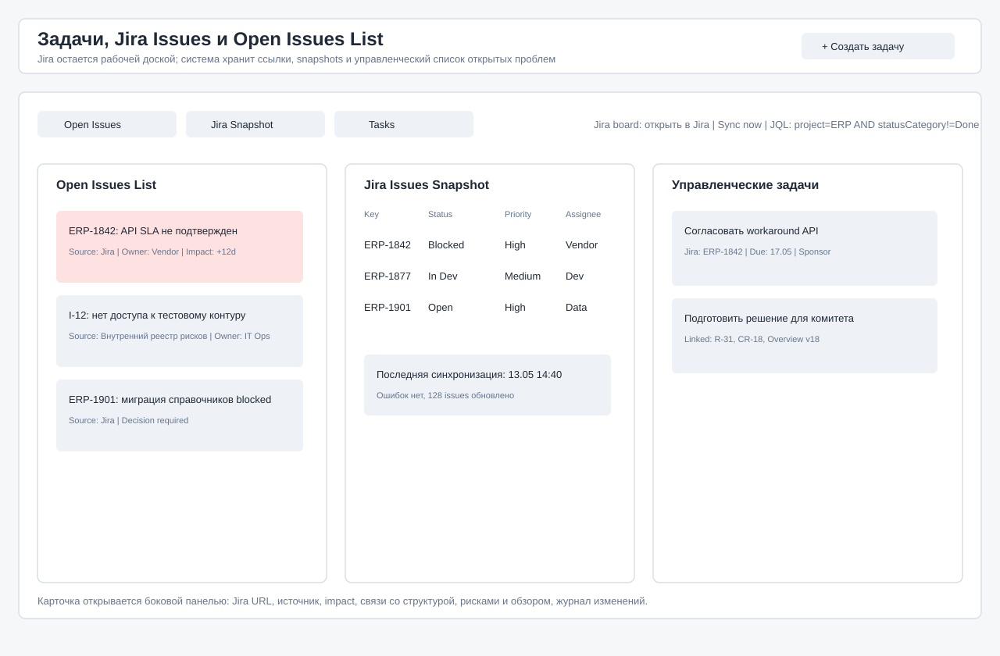

---

## 6.8 Модуль ресурсов и загрузки

### Назначение

Планирование и контроль людей, ролей, навыков, доступности, загрузки, ставок и конфликтов.

### Функции

- Resource directory:
  - сотрудник/внешний ресурс/виртуальный ресурс;
  - роль;
  - skill matrix;
  - cost rate;
  - location/time zone;
  - manager;
  - availability;
  - calendar;
  - employment type.
- Capacity planning:
  - capacity by person/role/team;
  - demand by project/task;
  - allocation heatmap;
  - overload/underload;
  - forecast demand;
  - conflicts.
- Resource requests:
  - PM создает запрос ресурса;
  - Resource Manager утверждает/заменяет;
  - связь с project plan.
- Timesheets:
  - weekly time entry;
  - approval;
  - billable/non-billable;
  - export to finance.
- Impact:
  - изменения назначений пересчитывают cost forecast;
  - resource conflicts влияют на RAG проекта;
  - executive overview должен показывать critical resource constraints.

### Приемочные критерии

- Система показывает перегрузку ресурса выше 100% по неделям.
- Resource Manager может заменить ресурс и увидеть эффект на сроки/стоимость.
- PM не может назначить ресурс без соответствующих прав или approval, если включена политика.

### Эскиз

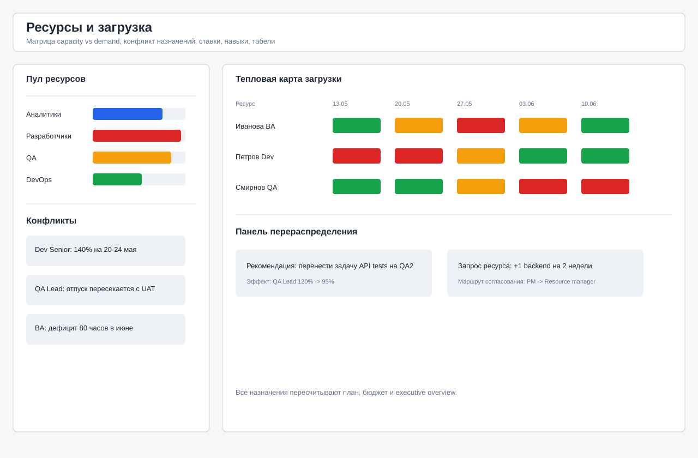

---

## 6.9 Модуль бюджета, затрат и финансового контроля

### Назначение

Планирование бюджета, учет фактических затрат, forecast, финансовые отклонения и поддержка управленческих решений.

### Функции

- Бюджет проекта:
  - planned budget;
  - approved budget;
  - actual cost;
  - committed cost;
  - forecast/EAC;
  - variance;
  - contingency reserve;
  - CAPEX/OPEX;
  - currency;
  - VAT/tax handling как configurable field.
- Cost categories:
  - labor;
  - vendor;
  - licenses;
  - hardware;
  - travel;
  - other.
- Расчет трудозатрат:
  - rate × planned hours;
  - rate × actual hours;
  - role-based rates;
  - individual rates с ограничением доступа.
- Earned Value Management:
  - PV;
  - EV;
  - AC;
  - CPI;
  - SPI.
- Финансовые approvals:
  - budget change request;
  - threshold-based approvals;
  - finance review.
- Integrations:
  - импорт actuals из ERP/1C/SAP через CSV/API;
  - export в BI.

### Приемочные критерии

- Изменение forecast выше порога создает предупреждение и влияет на budget RAG.
- Finance Controller видит детализацию затрат, PM видит только разрешенный уровень.
- Утвержденный CR обновляет approved budget или forecast по правилам.

### Эскиз

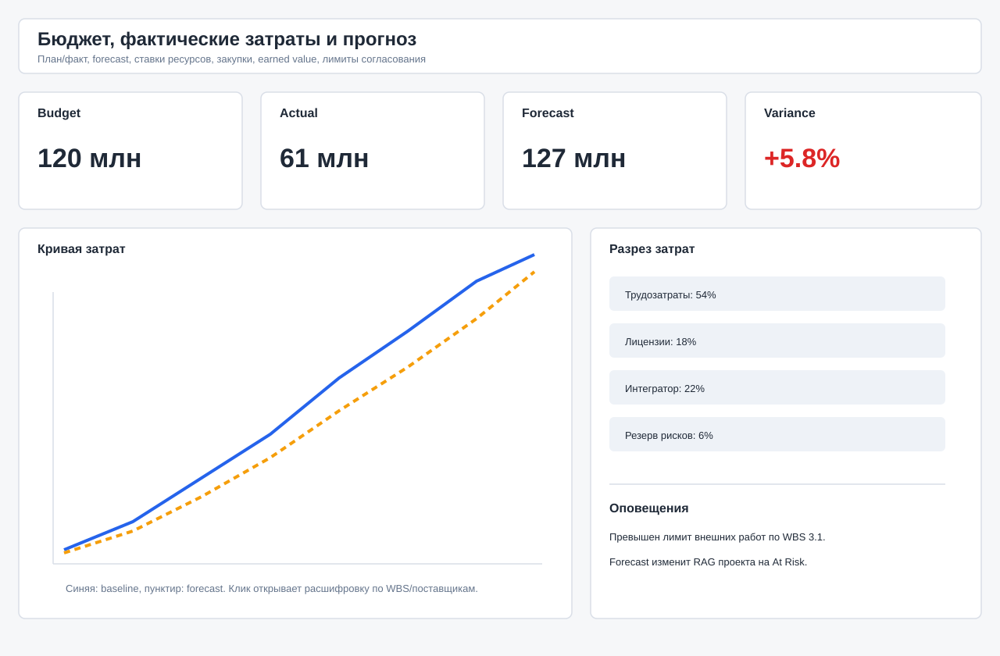

---

## 6.10 Модуль реестра рисков и управления изменениями

### Назначение

Единый реестр рисков, допущений, проблем, зависимостей и change requests с влиянием на проектный план, бюджет и executive overview.

### Функции

- Risk register:
  - description;
  - probability;
  - impact;
  - risk score;
  - owner;
  - mitigation plan;
  - contingency plan;
  - due date;
  - residual risk;
  - status.
- Issues:
  - open issues list;
  - impact on schedule/budget/scope;
  - owner;
  - escalation level;
  - decision required.
- Assumptions:
  - validation date;
  - owner;
  - linked risk if assumption fails.
- Dependencies:
  - internal/external;
  - predecessor/successor;
  - project-to-project dependency;
  - supplier dependency.
- Change Requests:
  - scope/budget/schedule/resource change;
  - impact analysis;
  - affected baseline;
  - approval workflow;
  - implementation plan.
- Матрица probability/impact настраивается в админке.
- Автоматическая эскалация:
  - high risk без mitigation plan;
  - overdue issue;
  - CR pending longer than threshold.

### Приемочные критерии

- Риск высокого уровня без владельца не может быть сохранен.
- Утвержденный CR создает запись в audit log и меняет связанные baseline/forecast.
- Executive overview показывает только top-N risks/issues по правилам шаблона.

### Эскиз

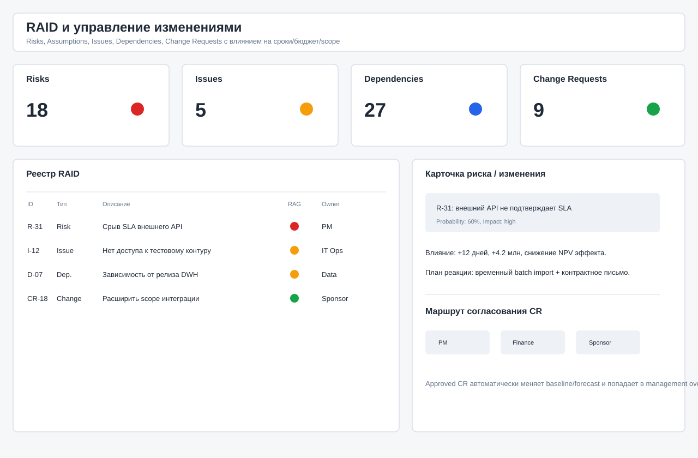

---

## 6.11 Модуль dashboards и отчетности

### Назначение

Создание интерактивных отчетов для PM, PMO, портфельных менеджеров и руководства.

### Функции

- Dashboard builder:
  - widgets;
  - charts;
  - tables;
  - KPI cards;
  - timeline;
  - heatmap;
  - text blocks;
  - filters.
- Уровни dashboards:
  - personal;
  - project;
  - program;
  - portfolio;
  - executive;
  - admin/system.
- Widgets:
  - project RAG;
  - milestone status;
  - overdue tasks;
  - budget variance;
  - resource utilization;
  - risk exposure;
  - decisions pending;
  - change requests;
  - benefits tracking.
- Drill-down до источника.
- Scheduled reports:
  - email;
  - PDF;
  - CSV/XLSX;
  - webhook.
- Snapshots для отчетной даты.
- Права на виджеты с финансовыми и персональными данными.

### Приемочные критерии

- Dashboard отражает новые данные без ручного пересоздания.
- Пользователь может перейти из KPI card к списку объектов, сформировавших показатель.
- Scheduled report отправляется по расписанию и фиксируется в журнале.

---

## 6.12 Модуль Executive Overview для топ-менеджмента

### Назначение

Автоматизировать подготовку кратких, проверяемых и согласованных управленческих обзоров по проекту, программе или портфелю.

### Почему это отдельный модуль

Dashboards отвечают на вопрос “что происходит сейчас?”. Executive Overview должен отвечать на управленческие вопросы:

- Что изменилось с прошлого комитета?
- Что критично?
- Какие решения нужны от руководства?
- Каков эффект решения/задержки решения?
- Какие цифры подтверждены источниками?
- Кто отредактировал текст и кто его согласовал?
- Какая версия была показана руководству?

### Подмодули

#### 6.12.1 Overview Data Collector

- Собирает данные из:
  - project health;
  - Gantt/baseline/forecast;
  - budget/actual/forecast;
  - реестр рисков;
  - resource conflicts;
  - milestones;
  - change requests;
  - decisions;
  - status updates;
  - linked documents.
- Для каждой метрики сохраняет:
  - source object;
  - source timestamp;
  - calculation formula;
  - owner;
  - freshness status.

#### 6.12.2 Template Engine

- Шаблоны:
  - One-page executive summary;
  - Steering Committee Pack;
  - Portfolio Monthly Review;
  - Crisis Update;
  - Board Pack;
  - Sponsor Weekly Brief.
- Настраиваемые блоки:
  - Executive summary;
  - RAG and trend;
  - Decisions required;
  - Key achievements;
  - Key blockers;
  - Schedule;
  - Budget;
  - Resource constraints;
  - Top risks/issues;
  - Next milestones;
  - Appendix;
  - Evidence list.

#### 6.12.3 Narrative Generator

- Генерация черновика текста по шаблону.
- Источники генерации только из разрешенных данных системы.
- Поддержка правил:
  - не скрывать Red/Amber статусы;
  - указывать impact для каждого decision request;
  - показывать изменения с прошлой версии;
  - не использовать метрики без источника;
  - помечать устаревшие данные.
- AI-генерация должна быть опциональной:
  - режим без AI: deterministic templates;
  - режим с AI: LLM через внутренний gateway.
- Любой AI-текст должен иметь метку “AI-generated draft” до ручного подтверждения.

#### 6.12.4 Evidence Panel

- Для каждого числа и утверждения показывать источник:
  - объект;
  - ссылка;
  - дата обновления;
  - владелец;
  - формула.
- Система должна подсвечивать:
  - метрики без источника;
  - устаревшие источники;
  - ручную правку, противоречащую данным;
  - расхождение RAG с формулой.

#### 6.12.5 Editorial Workflow

- Состояния:
  - Draft;
  - Generated;
  - PM Edited;
  - PMO Review;
  - Finance Review;
  - Sponsor Review;
  - Approved;
  - Published;
  - Archived.
- Комментарии и review notes.
- Track changes.
- Сравнение версий.
- Mandatory checks before publish.

#### 6.12.6 Presentation Mode

- Web presentation mode:
  - one-page overview;
  - slide mode;
  - full-screen;
  - evidence panel;
  - decision register;
  - appendix.
- Экспорт:
  - PDF;
  - PPTX;
  - PNG для отдельных слайдов;
  - share link с expiry.
- Публикация:
  - доступ по ролям;
  - watermark;
  - audit of views/downloads;
  - version lock.

#### 6.12.7 Decision Register

- В overview должны выделяться решения, требуемые от руководства:
  - decision title;
  - options;
  - recommendation;
  - impact if approved;
  - impact if delayed;
  - deadline;
  - decision owner;
  - required approvers.
- После публикации решение может быть:
  - approved;
  - rejected;
  - deferred;
  - delegated.
- Approved decision автоматически создает задачи/CR/изменения плана.

### Приемочные критерии

- PM может за 5 минут сгенерировать draft overview из текущих данных проекта.
- Нельзя опубликовать overview, если ключевые KPI не имеют источника или данные устарели по правилам шаблона.
- Руководитель видит one-page version и может открыть evidence только при необходимости.
- Опубликованная версия immutable: редактирование создает новую версию.
- Экспорт PDF/PPTX совпадает с опубликованной web-версией.

### Эскизы

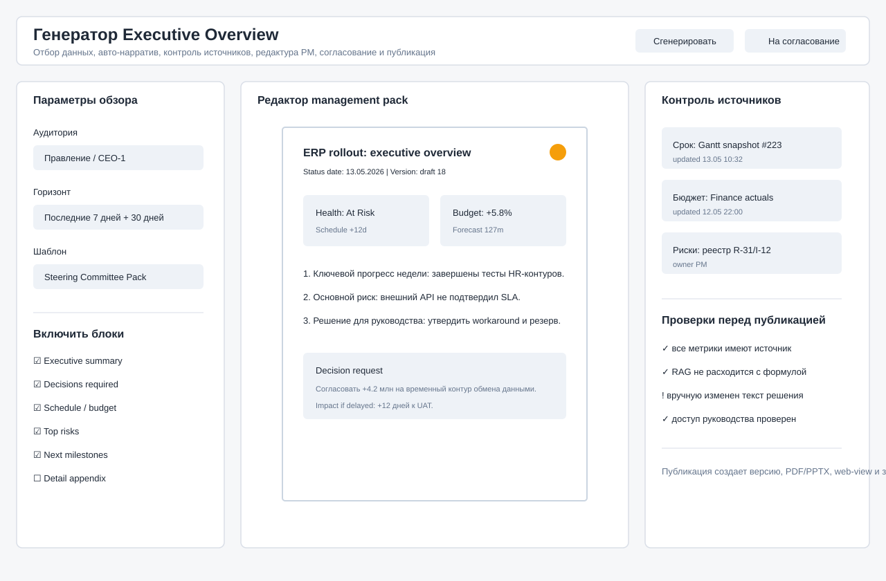

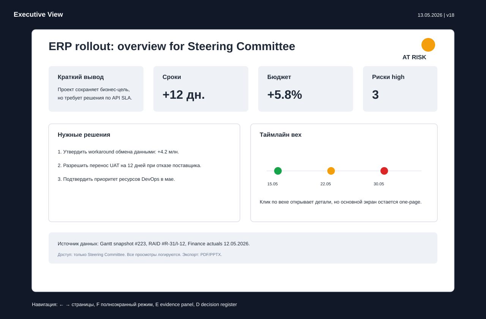

---

## 6.13 Модуль документов и базы знаний проекта

### Назначение

Хранение проектных документов, ссылок, протоколов, решений и рабочих материалов.

### Функции

- Document repository:
  - folders;
  - tags;
  - versioning;
  - permissions;
  - check-in/check-out optional;
  - preview;
  - full-text search.
- Wiki/pages:
  - project charter;
  - meeting notes;
  - architecture decisions;
  - lessons learned.
- Linked documents:
  - к проекту;
  - к задаче;
  - к риску;
  - к CR;
  - к overview.
- Интеграции:
  - S3/MinIO;
  - Nextcloud/SharePoint как optional connectors.

### Приемочные критерии

- Документ имеет версию, автора, дату и список связанных объектов.
- Удаление документа выполняется soft delete с возможностью восстановления администратором.

---

## 6.14 Модуль уведомлений и коммуникаций

### Функции

- In-app notifications.
- Email notifications.
- Digest:
  - daily personal digest;
  - weekly project digest;
  - executive digest.
- Subscriptions:
  - project;
  - task;
  - risk;
  - overview.
- Rules:
  - overdue task;
  - RAG changed;
  - budget threshold exceeded;
  - high risk created;
  - overview awaiting approval.
- Интеграции:
  - Microsoft Teams;
  - Slack;
  - Telegram/Matrix optional.

---

## 6.15 Модуль интеграций и API

### API

- REST API для основных операций.
- Webhook API для событий:
  - project.updated;
  - task.status_changed;
  - risk.created;
  - cr.approved;
  - overview.published.
- OpenAPI specification.
- Service accounts и API tokens.
- Rate limiting.

### Интеграции

- Identity:
  - OIDC/SAML;
  - LDAP/AD optional.
- BI:
  - Power BI;
  - Metabase/Superset;
  - direct read replica или analytics schema.
- Dev tools:
  - Jira;
  - GitLab;
  - Azure DevOps;
  - GitHub.
- Jira connector:
  - синхронизация issues по JQL;
  - синхронизация open issues/blockers по отдельному JQL;
  - хранение issue snapshots для отчетности;
  - deep links на Jira tickets и board;
  - ручной и scheduled sync;
  - audit ошибок синхронизации;
  - webhook-приемник Jira как optional enhancement.
- Finance/ERP:
  - CSV import;
  - SFTP import;
  - REST connector;
  - 1C/SAP adapter как отдельная поставка.
- Calendars:
  - iCalendar export;
  - Outlook/Google calendar optional.

### Приемочные критерии

- Внешняя система может получить список проектов и статусов через API с учетом прав.
- Webhook отправляется при публикации executive overview.
- Ошибки интеграций видны в admin back office.

---

## 6.16 Модуль аудита, соответствия и контроля данных

### Требования

- Audit log для:
  - login/logout;
  - changes;
  - deletions;
  - exports;
  - permission changes;
  - overview generation/publication;
  - AI generation events.
- immutable audit records.
- Data retention policies.
- Soft delete для бизнес-объектов.
- Legal hold optional.
- Экспорт audit log для проверок.
- Data lineage для отчетных метрик.

---

## 7. RAG и расчет здоровья проекта

### 7.1 Базовая модель

Overall RAG должен рассчитываться настраиваемой формулой из доменов:

- Schedule health;
- Budget health;
- Scope health;
- Resource health;
- Risk health;
- Issue/Blocker health;
- Decision latency;
- Data freshness.

Пример:

```text
overall_score =
  schedule_score * 0.25 +
  budget_score * 0.20 +
  risk_score * 0.20 +
  resource_score * 0.15 +
  scope_score * 0.10 +
  decision_score * 0.10
```

### 7.2 Правила

- Green: score >= 80 и нет red blockers.
- Amber: 50 <= score < 80 или есть material issue.
- Red: score < 50 или есть critical blocker / budget breach / executive decision overdue.
- Manual override разрешен только с причиной и сроком действия.
- Executive overview обязан показывать manual override как отдельный факт.

---

## 8. Основные сущности данных

| Сущность | Ключевые поля |
|---|---|
| User | id, name, email, status, roles, groups, last_login |
| OrganizationUnit | id, name, parent_id, manager_id |
| Portfolio | id, name, owner_id, strategic_goals, status |
| Program | id, portfolio_id, name, owner_id, status |
| Project | id, code, name, portfolio_id, sponsor_id, pm_id, status, rag, dates, budget |
| Initiative | id, title, requester, score, status, business_case |
| WorkPackage | id, project_id, parent_id, type, title, dates, progress |
| Task | id, work_package_id, assignee_id, status, priority, dates, estimate, actual, jira_ticket_key, jira_ticket_url |
| Dependency | id, source_id, target_id, type, lag, external_flag |
| Resource | id, user_id, role, skills, calendar_id, cost_rate |
| Assignment | id, task_id, resource_id, planned_hours, actual_hours |
| Timesheet | id, user_id, week, status, approved_by |
| BudgetLine | id, project_id, category, planned, actual, forecast |
| Risk | id, project_id, probability, impact, score, owner, status |
| Issue | id, project_id, source, jira_ticket_key, jira_ticket_url, severity, impact, owner, status, decision_required |
| IssueJiraLink | id, issue_id, jira_key, jira_url, created_at |
| JiraIntegration | id, project_id, base_url, board_url, project_key, issues_jql, open_issues_jql, sync_status |
| JiraIssueSnapshot | id, project_id, issue_key, issue_url, summary, status, priority, assignee, issue_type, sprint, updated_at, synced_at |
| ChangeRequest | id, project_id, type, impact, status, approval_route |
| Decision | id, source, title, status, owner, due_date |
| Overview | id, scope_type, scope_id, version, status, generated_at, published_at |
| OverviewBlock | id, overview_id, block_type, content, source_refs |
| AuditEvent | id, actor_id, action, object_type, object_id, timestamp, diff |

---

## 9. Архитектурные требования

## 9.1 Рекомендуемая архитектура

Для первой промышленной версии рекомендуется модульный монолит с четкими доменными границами. Это быстрее и надежнее для старта, чем ранний набор микросервисов. Внутри приложения домены должны быть изолированы на уровне модулей, схем БД, сервисов и событий.

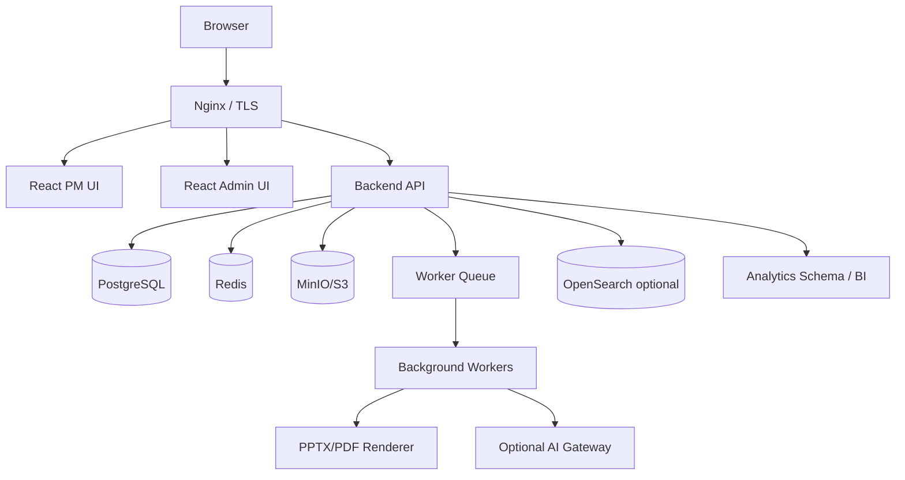

## 9.2 Backend

- Язык: TypeScript.
- Framework: NestJS или Fastify-based modular backend.
- API: REST + OpenAPI.
- Realtime: WebSocket/SSE для уведомлений и live updates.
- ORM: Prisma или TypeORM; предпочтительно Prisma для типизации и миграций.
- Background jobs: BullMQ + Redis.
- PDF/PPTX rendering:
  - Playwright/Chromium для PDF;
  - pptxgenjs или server-side template renderer для PPTX.

## 9.3 Frontend

- React + TypeScript.
- Vite.
- UI components: собственная design system на базе Radix UI/headless components или Ant Design Enterprise, если нужен быстрый enterprise UI.
- State/data:
  - TanStack Query;
  - Zustand для UI state.
- Tables:
  - TanStack Table.
- Gantt:
  - коммерческий компонент для enterprise-качества или open-source Gantt с обязательной проверкой масштабируемости.
- Charts:
  - Apache ECharts или Recharts.

## 9.4 База данных

- PostgreSQL как основная OLTP БД.
- Отдельные схемы:
  - core;
  - projects;
  - portfolio;
  - resources;
  - finance;
  - reporting;
  - audit.
- JSONB для custom fields, но ключевые отчетные поля должны быть нормализованы.
- Row-level access желательно реализовывать на уровне application service; PostgreSQL RLS можно рассмотреть для особо чувствительных данных.

## 9.5 Хранилище файлов

- MinIO on-prem или S3-compatible storage.
- Метаданные файлов в PostgreSQL.
- Antivirus scanning optional.
- Versioning и retention policy.

## 9.6 Поиск

- MVP: PostgreSQL full-text search.
- Enterprise: OpenSearch для полнотекстового поиска по документам, задачам, рискам, комментариям.

---

## 10. Развертывание на Ubuntu Server

## 10.1 Минимальная конфигурация для MVP

- Ubuntu Server 24.04 LTS или 22.04 LTS.
- CPU: 4 vCPU.
- RAM: 16 GB.
- Disk: 200 GB SSD.
- Docker Engine + Docker Compose plugin.
- Nginx reverse proxy.
- PostgreSQL 16+.
- Redis 7+.
- MinIO.
- Node.js LTS для build/development; в production предпочтительно containerized runtime.

## 10.2 Рекомендуемая конфигурация для production

- 2 application nodes: 4-8 vCPU, 16-32 GB RAM.
- 1 PostgreSQL primary + 1 replica.
- Отдельный storage volume для MinIO/S3.
- Redis с persistence.
- Reverse proxy / load balancer.
- Monitoring node.
- Separate backup storage.

## 10.3 Сетевые порты

| Компонент | Порт | Доступ |
|---|---:|---|
| Nginx HTTPS | 443 | users |
| Nginx HTTP | 80 | redirect to HTTPS |
| Backend API | 3000/8080 | internal |
| PostgreSQL | 5432 | internal only |
| Redis | 6379 | internal only |
| MinIO API | 9000 | internal |
| MinIO Console | 9001 | admin/VPN only |

## 10.4 Deployment pipeline

- Git repository.
- CI:
  - lint;
  - typecheck;
  - unit tests;
  - integration tests;
  - build docker images;
  - migration dry-run.
- CD:
  - deploy to staging;
  - smoke tests;
  - manual approval;
  - deploy to production;
  - post-deploy health check.

## 10.5 Backup и восстановление

- PostgreSQL:
  - daily full backup;
  - WAL archiving;
  - retention 30/90/365 configurable.
- MinIO/S3:
  - daily incremental backup;
  - versioning.
- Redis:
  - не считать источником истины;
  - persistence для очередей.
- Recovery targets:
  - RPO: до 15 минут для production;
  - RTO: до 4 часов для production.

## 10.6 Monitoring и logging

- Prometheus + Grafana.
- Loki или OpenSearch для logs.
- Metrics:
  - API latency;
  - error rate;
  - DB connections;
  - queue length;
  - job failures;
  - PDF/PPTX render time;
  - overview generation failures;
  - disk usage;
  - backup status.
- Alerts:
  - service down;
  - DB replication lag;
  - failed backups;
  - queue stuck;
  - disk > 80%;
  - error rate > threshold.

---

## 11. Нефункциональные требования

## 11.1 Производительность

- Открытие dashboard проекта: до 2 секунд при 95 percentile для типового проекта.
- Открытие Gantt до 2 000 задач: до 3 секунд initial render.
- Поиск по объектам: до 1 секунды для metadata search.
- Генерация executive overview draft: до 60 секунд для проекта, до 180 секунд для портфеля.
- Экспорт PDF one-page overview: до 30 секунд.
- Экспорт PPTX pack до 20 слайдов: до 120 секунд.

## 11.2 Масштабируемость

Целевая первая промышленная версия:

- 1 000 активных пользователей.
- 10 000 проектов в архиве.
- 500 активных проектов.
- 1 000 000 задач.
- 100 000 файлов.
- 10 000 published overview versions.

## 11.3 Доступность

- MVP: 99.0%.
- Production target: 99.5%.
- Плановое обслуживание должно объявляться заранее.

## 11.4 Безопасность

- TLS 1.2+.
- Password hashing: Argon2id или bcrypt с актуальными параметрами.
- Secrets только через environment/secret manager, не в репозитории.
- CSRF protection для cookie-based auth или secure token strategy.
- Rate limiting для login/API.
- Audit для чувствительных операций.
- Access review reports.
- Защита экспорта executive materials:
  - watermark;
  - expiring links;
  - download audit;
  - optional IP allowlist.

## 11.5 Локализация

- Базовый язык UI: русский.
- Архитектурно предусмотреть i18n.
- Форматы дат, валют и чисел должны быть настраиваемыми.

---

## 12. Требования к UX/UI

## 12.1 Общие принципы

- Интерфейс должен быть рабочим enterprise UI, не маркетинговой страницей.
- Плотная, но читаемая компоновка.
- Минимум декоративных элементов.
- Все важные KPI должны иметь drill-down.
- В финансовых и executive экранах источник данных должен быть доступен в один клик.
- Не показывать пользователю функции, на которые у него нет прав.
- Поддержать keyboard shortcuts для power users:
  - search;
  - create task;
  - command palette;
  - save view.

## 12.2 Эскизы интерфейсов

Все эскизы приложены как редактируемые SVG:

1. [PM Portfolio Dashboard](wireframes/01-pm-portfolio-dashboard.svg)
2. [Project Overview / Status](wireframes/02-project-overview-status.svg)
3. [Gantt Planning](wireframes/03-gantt-planning.svg)
4. [Task Board / List](wireframes/04-task-board-list.svg)
5. [Resources / Workload](wireframes/05-resources-workload.svg)
6. [Finance / Costs](wireframes/06-finance-costs.svg)
7. [Риски и изменения](wireframes/07-raid-change-log.svg)
8. [Executive Overview Builder](wireframes/08-executive-overview-builder.svg)
9. [Executive Presentation](wireframes/09-executive-presentation.svg)
10. [Admin Console](wireframes/10-admin-console.svg)

---

## 13. API и события

### 13.1 Базовые API namespaces

- `/api/auth`
- `/api/users`
- `/api/admin`
- `/api/portfolios`
- `/api/programs`
- `/api/projects`
- `/api/tasks`
- `/api/jira`
- `/api/wbs`
- `/api/gantt`
- `/api/resources`
- `/api/timesheets`
- `/api/finance`
- `/api/risk-register`
- `/api/change-requests`
- `/api/dashboards`
- `/api/overviews`
- `/api/documents`
- `/api/audit`

### 13.2 Domain events

- `ProjectCreated`
- `ProjectStatusChanged`
- `TaskStatusChanged`
- `JiraIssueSynced`
- `OpenIssueCreated`
- `OpenIssueEscalated`
- `BaselineCreated`
- `BaselineApproved`
- `ResourceOverallocated`
- `BudgetThresholdExceeded`
- `RiskBecameCritical`
- `ChangeRequestSubmitted`
- `ChangeRequestApproved`
- `OverviewGenerated`
- `OverviewPublished`
- `DecisionApproved`

---

## 14. Требования к тестированию

## 14.1 Unit tests

- RAG formulas.
- Access checks.
- Budget calculations.
- EVM calculations.
- Schedule dependency calculations.
- Overview block generation rules.

## 14.2 Integration tests

- Project creation from initiative.
- Jira project configuration and issue snapshot sync.
- Open Issues List aggregation from Jira snapshots and internal risk-register issues.
- Baseline creation and approval.
- CR impact on schedule/budget.
- Resource allocation conflict.
- Executive overview generation from source data.
- PDF/PPTX export.
- SSO login.

## 14.3 E2E tests

- PM создает проект из шаблона, строит план, назначает ресурсы, публикует статус.
- Finance Controller утверждает budget change.
- PM генерирует executive overview, PMO согласует, Sponsor публикует.
- Executive открывает опубликованный overview и принимает решение.
- Admin меняет RAG formula, новая формула применяется к проектам.

## 14.4 Security tests

- User cannot access another project without permission.
- Finance data hidden from unauthorized user.
- Published overview link expires.
- API rejects invalid token.
- Audit cannot be edited from application.

---

## 15. Этапы разработки

## 15.1 Этап 0. Discovery и проектирование

Срок: 2-4 недели.

Результаты:

- финализация требований;
- data model;
- architecture decision records;
- UX prototype;
- backlog;
- план релизов;
- оценка интеграций.

## 15.2 Этап 1. MVP Core

Срок: 10-14 недель.

Состав:

- auth/RBAC;
- projects;
- tasks;
- simple WBS/Gantt;
- project status;
- basic dashboards;
- admin dictionaries;
- audit base;
- Docker Compose deployment.

## 15.3 Этап 2. PMO / Portfolio

Срок: 10-12 недель.

Состав:

- initiatives/intake;
- portfolio/program hierarchy;
- scoring;
- stage gates;
- advanced dashboards;
- baseline;
- import/export.

## 15.4 Этап 3. Resources / Finance / реестр рисков

Срок: 12-16 недель.

Состав:

- resource directory;
- allocation heatmap;
- timesheets;
- budget/actual/forecast;
- реестр рисков;
- change requests;
- approval workflows.

## 15.5 Этап 4. Executive Overview

Срок: 10-14 недель.

Состав:

- data collector;
- templates;
- draft generation;
- evidence panel;
- editor;
- approvals;
- publish;
- PDF/PPTX export;
- decision register.

## 15.6 Этап 5. Enterprise hardening

Срок: 8-12 недель.

Состав:

- SSO;
- integrations;
- performance optimization;
- monitoring;
- backups;
- HA deployment;
- advanced audit;
- security testing.

---

## 16. Ограничения и допущения

- В первой версии система создается как единая корпоративная инсталляция, multi-tenant SaaS не требуется.
- Полноценный AI не должен быть критическим dependency: Executive Overview должен работать через deterministic templates без AI.
- Импорт MPP/MS Project может быть вынесен в отдельный этап, так как корректная поддержка MPP сложна.
- BI-интеграция должна быть предусмотрена архитектурно, но built-in dashboards остаются частью продукта.
- Все финансовые расчеты должны быть проверены Finance Owner перед production.

---

## 17. Ключевые риски проекта разработки

| Риск | Вероятность | Влияние | Митигирующее действие |
|---|---:|---:|---|
| Слишком широкий scope MVP | Высокая | Высокое | Разделить релизы, MVP ограничить core PM |
| Недооценка Gantt/auto scheduling | Средняя | Высокое | Рассмотреть готовый Gantt component |
| Неясные RAG formulas | Высокая | Среднее | Утвердить формулы с PMO до разработки |
| Интеграции с ERP/SSO затянут сроки | Средняя | Высокое | Делать adapter layer и CSV fallback |
| AI overview может давать спорный текст | Средняя | Высокое | Evidence panel, manual approval, no-AI template mode |
| Перегруженный UI | Средняя | Среднее | UX прототипирование с PM/PMO |

---

## 18. Definition of Done для первой промышленной версии

Система считается готовой к промышленной эксплуатации, если:

- развернута на Ubuntu Server через утвержденный deployment сценарий;
- настроен HTTPS, backups, monitoring и audit;
- работают PM UI и Admin UI;
- пользовательские роли и права применяются корректно;
- PM может вести проект от карточки до задач, плана, статуса, бюджета, рисков;
- PMO может видеть портфельную картину;
- Resource Manager видит загрузку и конфликты;
- Finance видит план/факт/forecast;
- Executive Overview создается, проверяется, согласуется и публикуется;
- экспорт PDF/PPTX работает;
- есть тестовое покрытие критичных расчетов;
- проведены security и performance smoke tests;
- подготовлена пользовательская и администраторская документация.
